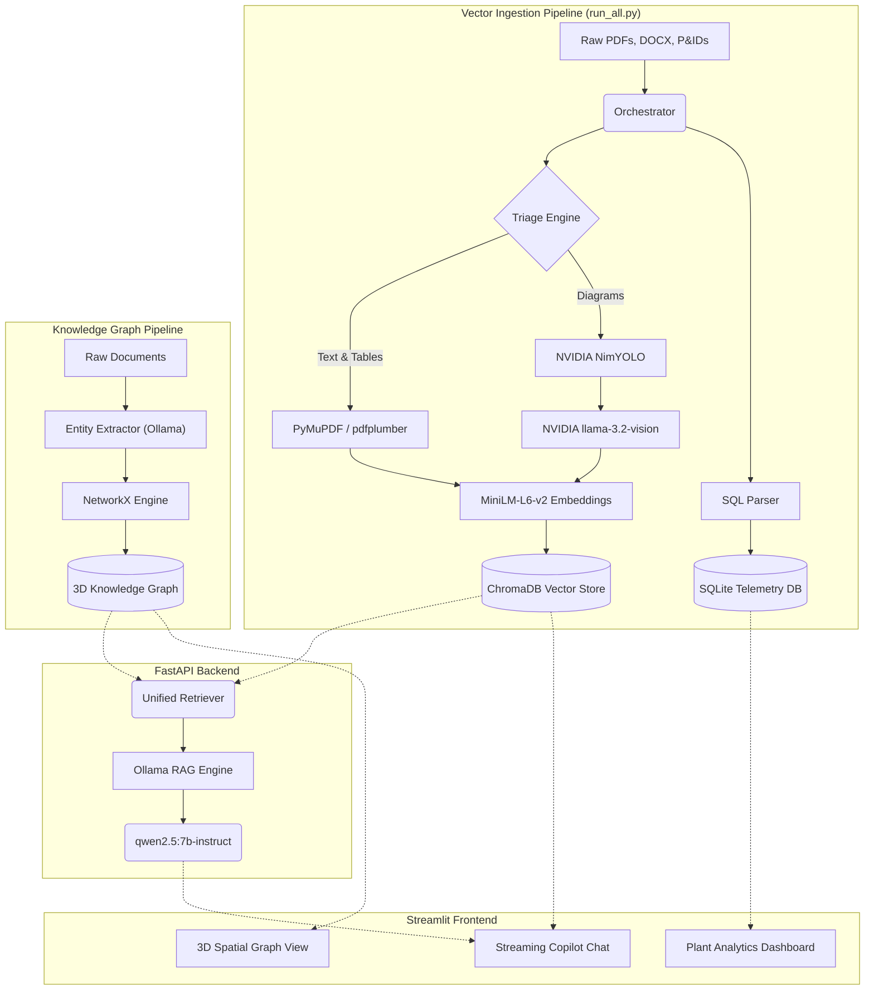

# System Architecture

```mermaid
flowchart TD
    subgraph Vector_Pipeline ["Vector Ingestion Pipeline (run_all.py)"]
        A[Raw PDFs, DOCX, P&IDs] --> B(Orchestrator)
        B --> C{Triage Engine}
        C -->|Text & Tables| D[PyMuPDF / pdfplumber]
        C -->|Diagrams| E[NVIDIA NimYOLO]
        E --> F[NVIDIA llama-3.2-vision]
        F --> H[MiniLM-L6-v2 Embeddings]
        D --> H
        H --> I[(ChromaDB Vector Store)]
        B --> L[SQL Parser]
        L --> M[(SQLite Telemetry DB)]
    end

    subgraph KG_Pipeline ["Knowledge Graph Pipeline"]
        A2[Raw Documents] --> X["Entity Extractor (Ollama)"]
        X --> J[NetworkX Engine]
        J --> K[(3D Knowledge Graph)]
    end

    subgraph FastAPI_Backend ["FastAPI Backend"]
        I -.-> N(Unified Retriever)
        K -.-> N
        N --> O[Ollama RAG Engine]
        O --> P("qwen2.5:7b-instruct")
    end

    subgraph Streamlit_Frontend ["Streamlit Frontend"]
        Q[Plant Analytics Dashboard]
        R[3D Spatial Graph View]
        S[Streaming Copilot Chat]
    end

    M -.-> Q
    K -.-> R
    P -.-> S
    I -.-> S
```
