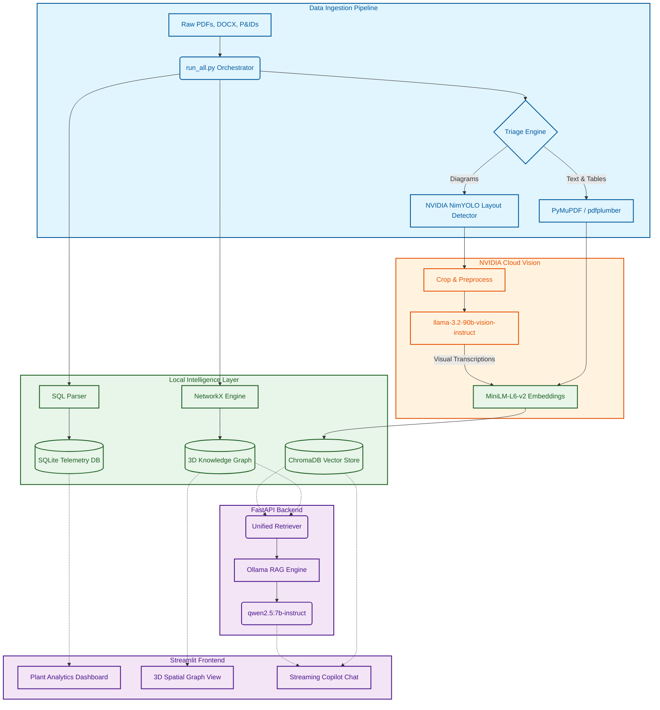

# System Architecture

```mermaid
flowchart TD
    %% Styling
    classDef pipeline fill:#e1f5fe,stroke:#01579b,stroke-width:2px,color:#01579b
    classDef cloud fill:#fff3e0,stroke:#e65100,stroke-width:2px,color:#e65100
    classDef db fill:#e8f5e9,stroke:#1b5e20,stroke-width:2px,color:#1b5e20
    classDef app fill:#f3e5f5,stroke:#4a148c,stroke-width:2px,color:#4a148c

    subgraph Data_Ingestion ["Data Ingestion Pipeline"]
        A[Raw PDFs, DOCX, P&IDs] --> B(run_all.py Orchestrator)
        B --> C{Triage Engine}
        C -->|Text & Tables| D[PyMuPDF / pdfplumber]
        C -->|Diagrams| E[NVIDIA NimYOLO Layout Detector]
    end
    class Data_Ingestion,A,B,C,D,E pipeline

    subgraph NVIDIA_Cloud ["NVIDIA Cloud Vision"]
        E --> F[Crop & Preprocess]
        F --> G[llama-3.2-90b-vision-instruct]
        G -->|Visual Transcriptions| H[Vectorization]
    end
    class NVIDIA_Cloud,F,G cloud

    subgraph Local_Intelligence ["Local Intelligence Layer"]
        D --> H[MiniLM-L6-v2 Embeddings]
        H --> I[(ChromaDB Vector Store)]
        
        B --> J[NetworkX Engine]
        J --> K[(3D Knowledge Graph)]
        
        B --> L[SQL Parser]
        L --> M[(SQLite Telemetry DB)]
    end
    class Local_Intelligence,H,I,J,K,L,M db

    subgraph FastAPI_Backend ["FastAPI Backend"]
        I -.-> N(Unified Retriever)
        N --> O[Ollama RAG Engine]
        O --> P(qwen2.5:7b-instruct)
    end
    class FastAPI_Backend,N,O,P app

    subgraph Streamlit_Frontend ["Streamlit Frontend"]
        Q[Plant Analytics Dashboard]
        R[3D Spatial Graph View]
        S[Streaming Copilot Chat]
    end
    class Streamlit_Frontend,Q,R,S app

    %% Cross-layer connections
    M -.-> Q
    K -.-> R
    K -.-> N
    P -.-> S
    I -.-> S
```
