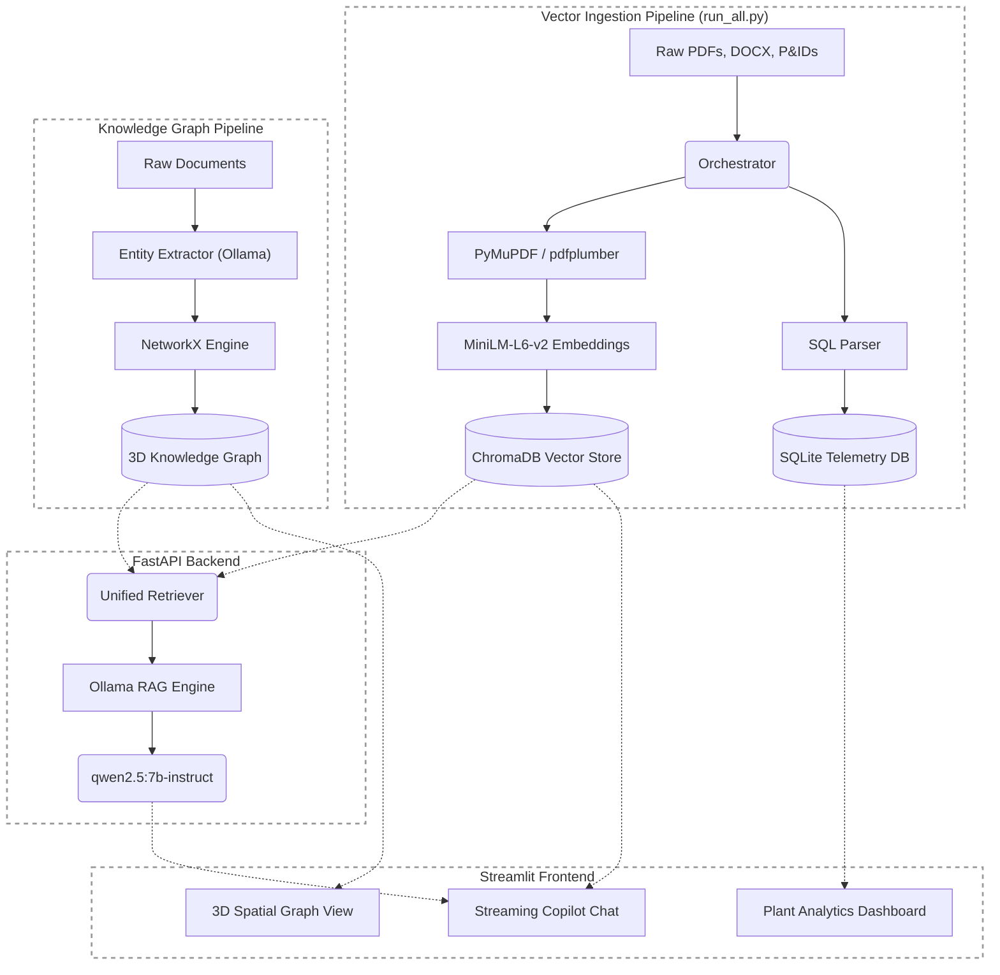

# System Architecture

```mermaid
flowchart TD
    subgraph Vector_Pipeline ["Vector Ingestion Pipeline (run_all.py)"]
        A[Raw PDFs, DOCX, P&IDs] --> B(Orchestrator)
        B --> D[PyMuPDF / pdfplumber]
        D --> H[MiniLM-L6-v2 Embeddings]
        H --> I[(ChromaDB Vector Store)]
        B --> L[SQL Parser]
        L --> M[(SQLite Telemetry DB)]
    end

    subgraph KG_Pipeline ["Knowledge Graph Pipeline"]
        A2[Raw Documents] --> X["Entity Extractor (Ollama)"]
        X --> J[NetworkX Engine]
        J --> K[(3D Knowledge Graph)]
    end

    subgraph FastAPI_Backend ["FastAPI Backend"]
        I -.-> N(Unified Retriever)
        K -.-> N
        N --> O[Ollama RAG Engine]
        O --> P("qwen2.5:7b-instruct")
    end

    subgraph Streamlit_Frontend ["Streamlit Frontend"]
        Q[Plant Analytics Dashboard]
        R[3D Spatial Graph View]
        S[Streaming Copilot Chat]
    end

    M -.-> Q
    K -.-> R
    P -.-> S
    I -.-> S

    %% Subgraph Styling to remove grey patches
    style Vector_Pipeline fill:transparent,stroke:#999,stroke-width:2px,stroke-dasharray: 5 5
    style KG_Pipeline fill:transparent,stroke:#999,stroke-width:2px,stroke-dasharray: 5 5
    style FastAPI_Backend fill:transparent,stroke:#999,stroke-width:2px,stroke-dasharray: 5 5
    style Streamlit_Frontend fill:transparent,stroke:#999,stroke-width:2px,stroke-dasharray: 5 5
```
