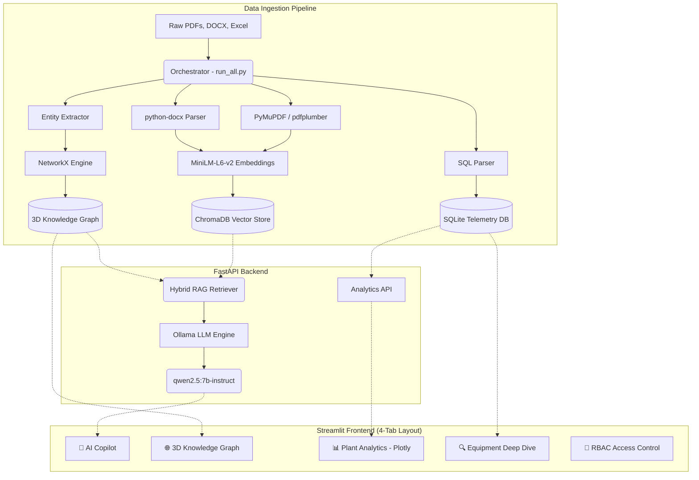

# System Architecture

```mermaid
flowchart TD
    subgraph Ingestion ["Data Ingestion Pipeline"]
        A[Raw PDFs, DOCX, Excel] --> B(Orchestrator - run_all.py)
        B --> C[PyMuPDF / pdfplumber]
        B --> D[python-docx Parser]
        B --> E[SQL Parser]
        C --> F[MiniLM-L6-v2 Embeddings]
        D --> F
        F --> G[(ChromaDB Vector Store)]
        E --> H[(SQLite Telemetry DB)]
        B --> I[Entity Extractor]
        I --> J[NetworkX Engine]
        J --> K[(3D Knowledge Graph)]
    end

    subgraph Backend ["FastAPI Backend"]
        G -.-> L(Hybrid RAG Retriever)
        K -.-> L
        L --> M[Ollama LLM Engine]
        M --> N("qwen2.5:7b-instruct")
        H -.-> O[Analytics API]
    end

    subgraph Frontend ["Streamlit Frontend (4-Tab Layout)"]
        P["💬 AI Copilot"]
        Q["🌐 3D Knowledge Graph"]
        R["📊 Plant Analytics - Plotly"]
        S["🔍 Equipment Deep Dive"]
        T["👤 RBAC Access Control"]
    end

    N -.-> P
    K -.-> Q
    O -.-> R
    H -.-> S
```
