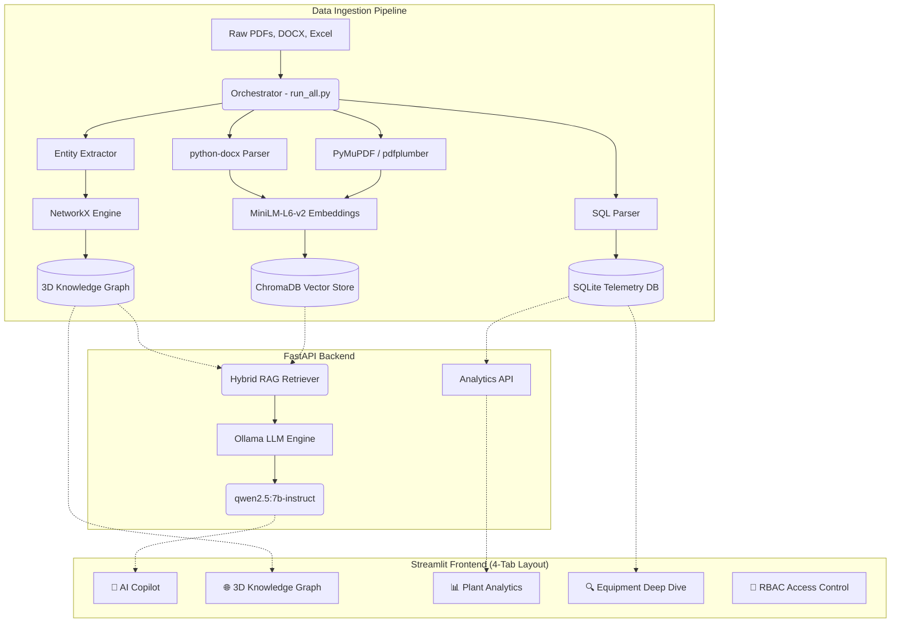

# NovaChem Industrial Knowledge Intelligence 🧠🏭

**ET AI Hackathon 2026 — Problem Statement 8: AI for Industrial Knowledge Intelligence**

## Overview

NovaChem Industrial Knowledge Intelligence is a comprehensive **"Unified Asset & Operations Brain"** for heavy industries. It tackles the multi-million dollar problem of knowledge fragmentation and the "knowledge cliff" in chemical plants, oil refineries, and manufacturing facilities.

By ingesting disconnected silos of information — P&IDs, maintenance logs, operating procedures, safety regulations — and unifying them into an actionable, real-time AI interface, this platform eliminates hours of manual data hunting and helps engineers trace equipment failures before they escalate.

---

## Key Features

### 💬 AI Copilot (Streaming RAG Chat)
- Real-time, streaming AI chat powered by a **local LLM** (Ollama `qwen2.5:7b-instruct`) and **RAG** (ChromaDB + Knowledge Graph).
- **Strictly Grounded Responses**: The AI is prompt-engineered to refuse answering when the context is insufficient. Every claim is backed by cited sources from the ingested documents.
- Quick Prompt buttons for common queries like equipment troubleshooting and OISD compliance checks.

### 🌐 3D Knowledge Graph
- Interactive, physics-based **3D WebGL visualization** (powered by `3d-force-graph`) mapping relationships between Equipment, Events, and Documents.
- **Target Lock Camera**: Type an equipment ID (e.g., `P-101`) and the 3D camera automatically flies across the graph to zoom in on that node.
- **Document Filter**: Toggle to hide Document nodes and reveal only physical equipment relationships.
- **Hover Highlighting**: Hovering over a node illuminates its direct neighbors and dims the rest.

### 📊 Plant Analytics Dashboard
- Interactive **Plotly** charts: Donut chart for equipment status, colored bar charts for event frequencies and downtime tracking.
- Downtime per equipment visualized with a red-gradient color scale to instantly highlight the worst-performing machines.

### 🔍 Equipment Deep Dive
- Select any equipment ID to instantly pull its manufacturer, installation year, lifecycle status, and recent failure events from the SQLite database.

### 👤 Role-Based Access Control (RBAC)
- Simulated enterprise login with three roles: **Plant Administrator**, **Maintenance Engineer**, and **Field Operator**.
- Each role has different access levels — Field Operators see only the AI Chat, Engineers unlock the Knowledge Graph and Deep Dive, and Administrators unlock the full Analytics Dashboard.

### 📥 Export Case File
- Export your entire investigation (chat history + cited Knowledge Graph entities) as a **Markdown** or **Plain Text** report with custom file naming.

### ℹ️ Built-In User Guide
- A detailed Help modal with expandable "Read More" sections explaining every feature's architecture and usage.

### 🖥️ System Diagnostics
- Live status indicators for the Knowledge Graph, Vector Store, and Local LLM connectivity.

---

## Tech Stack

| Layer | Technology |
|---|---|
| **Frontend** | Streamlit, Plotly, 3d-force-graph (WebGL) |
| **Backend** | FastAPI, Uvicorn |
| **LLM** | Ollama (`qwen2.5:7b-instruct`) — fully local, zero cloud dependency |
| **Vector Database** | ChromaDB (`all-MiniLM-L6-v2` embeddings) |
| **Knowledge Graph** | NetworkX (directed graph) |
| **Relational Database** | SQLite (equipment specs, events, downtime) |
| **Document Parsing** | PyMuPDF, pdfplumber, python-docx |
| **Data Processing** | Pandas, RapidFuzz (entity linking) |

---

## Architecture



---

## Installation & Setup

### Prerequisites
- **Python 3.11+**
- **Ollama** installed locally with the `qwen2.5:7b-instruct` model pulled
- **Git**

### Steps

1. **Clone the repository**:
   ```bash
   git clone https://github.com/AnjaliKumari3033/et_project.git
   cd et_project
   ```

2. **Set up the virtual environment**:
   ```bash
   python -m venv .venv
   # On Windows:
   .venv\Scripts\activate
   # On macOS/Linux:
   source .venv/bin/activate
   pip install -r requirements.txt
   ```

3. **Configure Environment Variables**:
   ```bash
   cp .env.example .env
   ```
   Edit `.env` and set:
   ```env
   OLLAMA_HOST=http://localhost:11434
   OLLAMA_MODEL=qwen2.5:7b-instruct
   ```

4. **Ensure Ollama is running**:
   ```bash
   ollama serve
   ollama pull qwen2.5:7b-instruct
   ```

5. **Run the Application**:
   ```bash
   python run_all.py
   ```
   This launches both the FastAPI backend and Streamlit frontend. Open the provided localhost URL in your browser.

---

## Project Structure

```
et_project/
├── backend/
│   ├── main.py              # FastAPI server (chat, analytics, equipment APIs)
│   ├── retriever.py          # Hybrid RAG retriever (Vector + Knowledge Graph)
│   ├── llm_service.py        # Ollama LLM integration (streaming + sync)
│   └── schemas.py            # Pydantic request/response models
├── frontend/
│   └── app.py                # Streamlit UI (4-tab layout, RBAC, Plotly)
├── ingestion/
│   ├── build_graph.py        # Knowledge Graph construction
│   ├── build_sql.py          # SQLite database builder
│   ├── embed_all.py          # ChromaDB embedding pipeline
│   ├── ingest_docx.py        # DOCX document parser
│   ├── ingest_pdfs.py        # PDF ingestion pipeline
│   └── ingest_vision.py      # NVIDIA NIM vision pipeline (experimental)
├── knowledge_graph/
│   ├── build_graph.py        # Graph builder
│   ├── extract_entities.py   # LLM-based entity extraction
│   ├── graph_queries.py      # Graph query utilities
│   └── read_documents.py     # Document reader
├── data/
│   ├── chroma/               # ChromaDB vector store (pre-computed)
│   ├── graph/                # Serialized knowledge graphs
│   └── sqlite/               # SQLite database
├── Dataset/                  # Raw source data (Excel, DOCX, PDFs)
├── run_all.py                # One-click orchestrator
├── requirements.txt          # Python dependencies
├── .env.example              # Environment variable template
└── .gitignore                # Git exclusions (protects .env)
```

---

## Security & Data Privacy

- **100% Local Execution**: The LLM (Ollama) and Vector Store (ChromaDB) run entirely on-premise. No proprietary plant data ever touches the public internet.
- **API Key Protection**: All sensitive credentials are stored in `.env` (excluded from Git via `.gitignore`).
- **Role-Based Access Control**: Enterprise-grade RBAC simulation ensures that sensitive analytics and equipment data are only accessible to authorized personnel.

---

## Future Enhancements

- **Vision AI Pipeline (NVIDIA NIM)**: The architecture is fully prepared to integrate a two-tier vision pipeline. Using a local layout detector (NimYOLO) to crop complex P&IDs and flowcharts, these images can be passed to NVIDIA's `llama-3.2-vision` API to transcribe structural schematics into dense markdown, expanding the copilot's capabilities to include spatial and diagrammatic reasoning.
- **Predictive Safety Alerts**: Integration with live SCADA/IoT sensor data to trigger real-time anomaly detection before equipment failure.
- **Emergency SOP Override**: One-button retrieval of evacuation routes, containment procedures, and shut-off valve locations during chemical emergencies.
- **Automated Risk Scoring**: AI-driven equipment risk scores (1-100) based on age, downtime history, and missed preventative maintenance.

---

## License

This project was built for the **ET AI Hackathon 2026**.