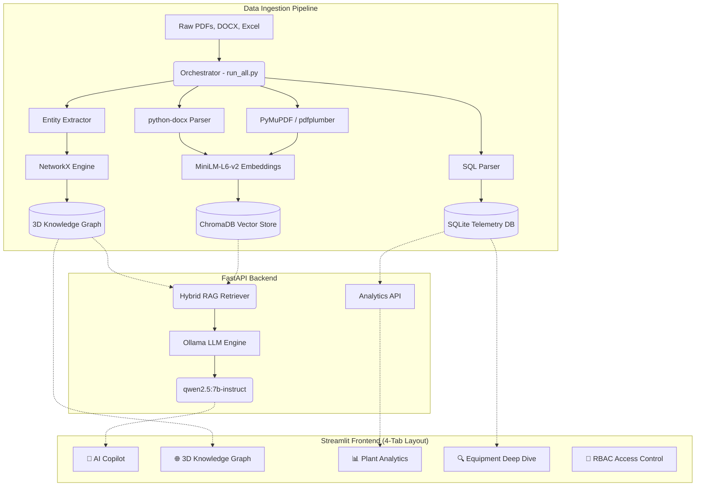

# Project Report: AI for Industrial Knowledge Intelligence

**Hackathon**: ET AI HACKATHON 2026  
**Problem Statement**: 8. AI for Industrial Knowledge Intelligence: Unified Asset & Operations Brain  

---

## 1. Executive Summary
Asset-intensive industries suffer from a critical "Knowledge Cliff." Crucial data—spanning unstructured P&IDs, historical work orders, and safety logs—is fragmented across disconnected systems, resulting in significant operational downtime. **NovaChem Industrial Knowledge Intelligence** is a robust, multi-modal AI platform designed to bridge this gap. By fusing disparate data formats into a singular, intelligently connected knowledge base, this solution equips on-site engineers with a unified, real-time brain for their physical assets, drastically reducing unplanned downtime and eliminating the manual hunt for documentation.

---

## 2. Business Impact (25% Weight)
- **Elimination of "Time Loss"**: Professionals spend ~35% of their time searching for information. Our streaming RAG Copilot returns hyper-accurate operational context in seconds, freeing up thousands of man-hours annually.
- **Predictive Maintenance & Uptime**: By correlating historical equipment failures (stored in SQLite) with real-time operational manuals, our system acts as an early warning layer, directly combating the 18-22% unplanned downtime common in heavy industry.
- **Solving the Knowledge Cliff**: As 25% of the experienced workforce retires, this platform mathematically encodes their decades of undocumented troubleshooting knowledge into an immutable, searchable 3D graph.
- **Enterprise Security Compliance**: Role-Based Access Control ensures sensitive plant analytics and equipment data are restricted to authorized personnel only, meeting enterprise governance requirements.

---

## 3. System Architecture Diagram

---

## 4. Technical Excellence (20% Weight)

The platform operates on a highly decoupled, asynchronous 7-stage pipeline:

### A. Universal Document Ingestion
Standard RAG pipelines fail on industrial schematics. Our solution uses `PyMuPDF` and `pdfplumber` to extract high-fidelity text and structured tables from massive P&IDs, operational manuals, and regulations directly into a highly precise Vector Store.

### B. Dynamic 3D Knowledge Graph
- **LLM Entity Extraction**: Instead of relying purely on regex, a separate independent pipeline feeds raw documents directly to a local Ollama model to intelligently extract complex entities (Equipment, Failure Modes, Standards) and their relationships.
- **Entity Linkage**: `NetworkX` takes these extracted JSON objects and builds a massive directed graph linking equipment IDs (e.g., `Pump-101`) to specific events, manuals, and troubleshooting nodes.
- **Interactive Visualization**: Rendered natively via WebGL (`3d-force-graph`), field technicians can visually explore failure patterns and trace root causes in 3D space, with Target Lock camera navigation and document filtering.

### C. Streaming Expert Knowledge Copilot
- **Server-Sent Events (SSE)**: The FastAPI backend streams tokens dynamically to the UI via NDJSON, providing instant response feedback.
- **Local-First Execution**: The language reasoning is powered entirely locally by Ollama (`qwen2.5:7b-instruct`), ensuring that sensitive, proprietary industrial data (like unreleased plant schematics) never leaves the corporate firewall.
- **Strictly Grounded Responses**: The system prompt enforces strict factual grounding — if the answer isn't in the ingested documents, the AI is instructed to refuse rather than guess. Every response includes auditable source citations.
- **Visual Source Verification**: Every AI response is backed by auditable source citations, displayed in expandable dropdowns within the chat UI.

### D. Role-Based Access Control (RBAC)
- Simulated enterprise RBAC with three distinct roles (Plant Administrator, Maintenance Engineer, Field Operator).
- Each role conditionally renders different UI elements — Field Operators only see the AI Chat, Engineers unlock the Knowledge Graph and Equipment Deep Dive, and Administrators access the full Plant Analytics Dashboard.

### E. Interactive Analytics Dashboard
- **Plotly-powered** interactive charts replace basic Streamlit bar charts for a premium, enterprise-grade analytical experience.
- Equipment status visualized as a donut chart, event types as colored bar charts, and downtime per equipment with a red-gradient color scale highlighting critical machines.

---

## 5. Scalability & User Experience (30% Weight)
- **Idempotent Background Processing**: The entire ingestion pipeline is governed by `run_all.py`, an orchestrator that manages checkpointing and state. If a node crashes, the system gracefully caches progress and resumes instantly on reboot.
- **4-Tab Professional Layout**: The frontend is structured into four dedicated tabs (AI Copilot, 3D Knowledge Graph, Plant Analytics, Equipment Deep Dive) with a minimal sidebar containing only global controls and settings.
- **Built-In Documentation**: A comprehensive User Guide modal with expandable "Read More" sections explains every feature's architecture and usage — eliminating the need for external documentation.
- **Export & Audit Trail**: Engineers can export their entire investigation session as a named Markdown or Text report for compliance records.

---

## 6. Conclusion
The **NovaChem Industrial Knowledge Intelligence** platform transforms reactive industrial maintenance into predictive, AI-driven operations. It is a complete, working prototype that successfully demonstrates how multimodal AI, Knowledge Graphs, and Role-Based Access Control can fundamentally solve the knowledge fragmentation crisis in heavy industries — while maintaining enterprise-grade security through fully local execution.

---

## 7. Future Scope
- **Vision AI Pipeline (NVIDIA NIM)**: The architecture is fully prepared to integrate a two-tier vision pipeline. Using a local layout detector (NimYOLO) to crop complex P&IDs and flowcharts, these images can be passed to NVIDIA's `llama-3.2-vision` API to transcribe structural schematics into dense markdown. This will expand the copilot's capabilities to include spatial and diagrammatic reasoning.
- **Predictive Safety Alerts**: Real-time IoT/SCADA sensor integration for predictive anomaly detection.
- **Emergency SOP Override**: One-button emergency response retrieval during chemical incidents.
- **Automated Risk Scoring**: AI-driven equipment health scores based on age, downtime, and maintenance compliance.