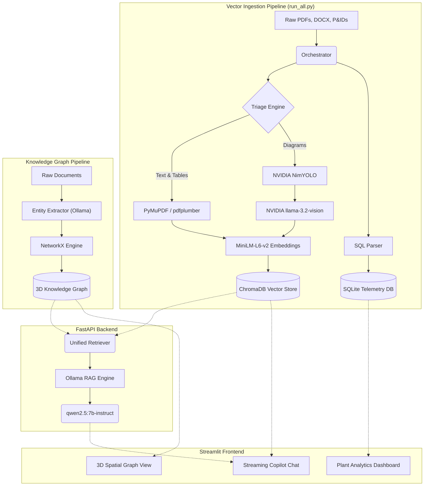

# Project Report: AI for Industrial Knowledge Intelligence

**Hackathon**: ET AI HACKATHON 2026  
**Problem Statement**: 8. AI for Industrial Knowledge Intelligence: Unified Asset & Operations Brain  

---

## 1. Executive Summary
Asset-intensive industries suffer from a critical "Knowledge Cliff." Crucial data—spanning unstructured P&IDs, historical work orders, and safety logs—is fragmented across disconnected systems, resulting in significant operational downtime. **NovaChem Industrial Knowledge Intelligence** is a robust, multi-modal AI platform designed to bridge this gap. By fusing disparate data formats into a singular, intelligently connected knowledge base, this solution equips on-site engineers with a unified, real-time brain for their physical assets, drastically reducing unplanned downtime and eliminating the manual hunt for documentation.

---

## 2. Business Impact (25% Weight)
- **Elimination of "Time Loss"**: Professionals spend ~35% of their time searching for information. Our streaming RAG Copilot returns hyper-accurate operational context in seconds, freeing up thousands of man-hours annually.
- **Predictive Maintenance & Uptime**: By correlating historical equipment failures (stored in SQLite) with real-time operational manuals, our system acts as an early warning layer, directly combating the 18-22% unplanned downtime common in heavy industry.
- **Solving the Knowledge Cliff**: As 25% of the experienced workforce retires, this platform mathematically encodes their decades of undocumented troubleshooting knowledge into an immutable, searchable 3D graph.

---

## 3. System Architecture Diagram

---

## 4. Technical Excellence (20% Weight)

The platform operates on a highly decoupled, asynchronous 7-stage pipeline:

### A. Universal Document Ingestion & Vision AI
Standard RAG pipelines fail on industrial schematics. Our solution solves this using a two-tier vision pipeline:
1. **Local Object Detection**: Uses an AI layout detector (`NimYOLO`) to scan thousands of PDF pages, ignoring generic text and dynamically cropping only the complex P&IDs, flowcharts, and technical tables.
2. **NVIDIA Cloud Transcription**: The cropped images are pushed to NVIDIA NIM's `llama-3.2-90b-vision-instruct` API. This massive model transcribes the visual meaning of the diagrams into highly dense Markdown context.

### B. Dynamic 3D Knowledge Graph
- **LLM Entity Extraction**: Instead of relying purely on regex, a separate independent pipeline feeds raw documents directly to a local Ollama model to intelligently extract complex entities (Equipment, Failure Modes, Standards) and their relationships.
- **Entity Linkage**: `NetworkX` takes these extracted JSON objects and builds a massive directed graph linking equipment IDs (e.g., `Pump-101`) to specific events, manuals, and troubleshooting nodes.
- **Interactive Visualization**: Rendered natively via Streamlit Components, field technicians can visually explore failure patterns and trace root causes in 3D space, illuminating the exact relationship between a manual and a failing asset.

### C. Streaming Expert Knowledge Copilot
- **Server-Sent Events (SSE)**: The FastAPI backend streams tokens dynamically to the UI.
- **Local-First Execution**: The language reasoning is powered entirely locally by Ollama (`qwen2.5:7b-instruct`), ensuring that sensitive, proprietary industrial data (like unreleased plant schematics) never leaves the corporate firewall. 
- **Visual Source Verification**: When the LLM answers a question based on an extracted diagram, the actual image crop is surfaced directly in the chat UI—providing immediate visual proof to the engineer without forcing them to open the original PDF.

---

## 5. Scalability & User Experience (30% Weight)
- **Idempotent Background Processing**: The entire ingestion pipeline is governed by `run_all.py`, an orchestrator that manages checkpointing and state. If the NVIDIA API rate-limits, or a node crashes, the system gracefully caches progress and resumes instantly on reboot.
- **Plant Analytics Dashboard**: A built-in SQLite-powered dashboard synthesizes high-level telemetry, displaying historical downtime, event frequencies, and real-time equipment status in an intuitive, operator-friendly view.

## 6. Conclusion
The **NovaChem Industrial Knowledge Intelligence** platform transforms reactive industrial maintenance into predictive, AI-driven operations. It is a complete, working prototype that successfully demonstrates how multimodal AI and Knowledge Graphs can fundamentally solve the knowledge fragmentation crisis in heavy industries.
